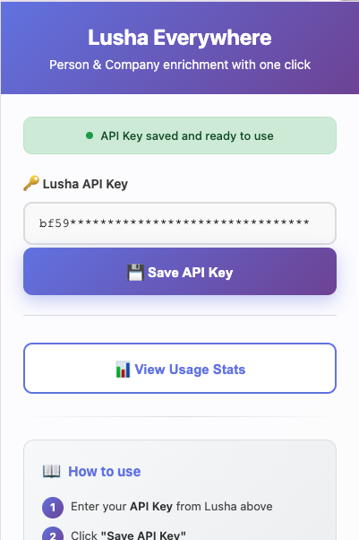
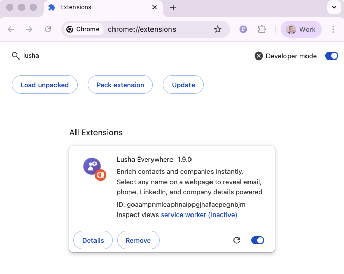

# Lusha Everywhere - Chrome Extension


**Enrich contacts and companies instantly. Select any name on a webpage to reveal email, phone, LinkedIn, and company details powered by Lusha API.**

Created by Shmulik Willinger

---

## Features

### Text Selection Enrichment
- **Person Enrichment**: Select a person's name to get:
  - Email addresses (personal + work)
  - Phone numbers with WhatsApp integration
  - LinkedIn profile
  - Current company and position
  - Location, seniority, department

- **Company Enrichment**: Select a company name to get:
  - Company logo and website
  - Industry, employee count, revenue
  - Founded year, headquarters
  - Social media links (LinkedIn, Twitter, Facebook)

### Smart Features
- **Automatic Company Detection**: Extracts company name from page context
- **Signals Integration**: View recent signals (job changes, promotions, news events, funding)
- **Quick Actions**: Person/Company buttons, LinkedIn search, WhatsApp integration
- **Usage Stats**: Track your API credit usage with visual progress bars

---

## Screenshots

### Settings Page


*Enter your Lusha API key and view usage statistics*

### Person Enrichment


*Get instant contact details with one click*

### Company Enrichment


*View company information and recent signals*

---

## Installation

1. **Clone or download this repository**
   ```bash
   git clone https://github.com/yourusername/lusha-everywhere.git
   cd lusha-everywhere
   ```

2. **Open Chrome Extensions page**
   - Navigate to `chrome://extensions/`
   - Or click the three dots menu → More tools → Extensions

3. **Enable Developer Mode**
   - Toggle the "Developer mode" switch in the top-right corner

4. **Load the extension**
   - Click "Load unpacked"
   - Select the `chrome-extension` folder from this project

   

5. **Pin the extension** (optional)
   - Click the puzzle icon in Chrome toolbar
   - Find "Lusha Everywhere" and click the pin icon

---

## Setup

### 1. Get Your Lusha API Key

1. Go to [Lusha API Documentation](https://docs.lusha.com/guides)
2. Navigate to API settings in your dashboard
3. Copy your API key

### 2. Configure the Extension

1. Click the Lusha Everywhere icon in your Chrome toolbar
2. Paste your API key in the input field
3. Click "Save API Key"
4. You should see a green success message: "API Key saved and ready to use"


### 3. Start Using

1. Go to any webpage (LinkedIn, company website, blog, etc.)
2. Select a person's name or company name
3. Click the "Person" or "Company" button that appears
4. View enriched data instantly!

---

## Usage

### Enrich a Person

1. **Select a name** on any webpage
   - Example: "Yoni Tserruya" or "John Doe"

2. **Click the Person button** (purple icon with person silhouette)

   > **Note:** Lusha's API expects a first name, last name, and company name to return accurate results. The extension automatically tries to detect the company name from the context near the selected name on the page. However, if the company name is not visible or detected correctly, the results may be inaccurate or missing. In such cases, use the **"Refine Search"** button to manually enter the person's company name and get more precise results.

3. **View the results**:
   - Email addresses with quick email action
   - Phone numbers with WhatsApp integration
   - LinkedIn profile link
   - Company and position
   - Department, seniority, location
   - Recent signals (job changes, promotions)

4. **Use Quick Actions**:
   - Click email icon to compose email
   - Click WhatsApp icon to start chat
   - Click LinkedIn icon to view profile
   - Click "Refine Search" to adjust search parameters

### Enrich a Company

1. **Select a company name** on any webpage
   - Example: "Lusha" or "Microsoft"

2. **Click the Company button** (purple icon with building)

3. **View the results**:
   - Company website
   - Industry and employee count
   - Revenue and founding year
   - Headquarters location
   - Description (with "Read more" for long text)
   - Recent signals (new jobs, news events, funding)

### Smart Company Detection

The extension automatically tries to detect the company name from the page context:
- LinkedIn profiles
- Company websites
- Team pages
- Blog posts

This helps improve person search accuracy without manual input.

### View Usage Statistics

1. Click the extension icon
2. Click "View Usage Stats"
3. See:
   - Remaining balance
   - Credits used vs. total credits
   - Visual progress bar

---

## Keyboard Shortcuts

- **Select text + Person button**: Enrich as person
- **Select text + Company button**: Enrich as company
- **Esc**: Close popup (coming soon)

---

## Technical Details

### Architecture

- **Manifest V3**: Modern Chrome extension format with service worker
- **Content Script**: Injects UI on every webpage
- **Background Service Worker**: Handles all API calls securely
- **Smart Company Extractor**: Intelligent parsing of page context

### API Endpoints Used

- `GET /v2/person` - Person enrichment
- `GET /v2/company` - Company enrichment
- `POST /api/signals/contacts/search` - Person signals
- `POST /api/signals/companies/search` - Company signals
- `GET /account/usage` - Usage statistics

### File Structure

```
chrome-extension/
├── manifest.json           # Extension configuration
├── background.js          # Service worker (API calls)
├── content.js            # UI injection and event handlers
├── content.css           # Popup styling
├── popup.html            # Settings page
├── popup.js              # Settings logic
├── company-extractor.js  # Smart company detection
└── icons/               # Extension icons
    ├── icon16.png
    ├── icon48.png
    └── icon128.png
```

---

## Development

### Requirements

- Google Chrome (or Chromium-based browser)
- Lusha API key
- Basic knowledge of Chrome Extensions

### Local Development

1. Make changes to the files in `chrome-extension/`
2. Go to `chrome://extensions/`
3. Click the refresh icon on the "Lusha Everywhere" card
4. Test your changes on any webpage

### Debugging

- **Content Script**: Right-click page → Inspect → Console tab
- **Background Script**: Extensions page → "service worker" link
- **Popup**: Right-click extension icon → Inspect popup

---

## Privacy & Security

- Your API key is stored securely in Chrome's sync storage
- The API key is masked in the UI (only first 4 characters visible)
- All API calls go directly from your browser to Lusha's API
- No data is collected or stored by this extension
- API key is never exposed to websites you visit

---

## Troubleshooting

### "No API Key configured" error
- Make sure you saved your API key in the extension settings
- Try re-entering and saving your API key

### "Invalid API Key" error
- Verify your API key is correct
- Check if your Lusha account is active
- Ensure you have API access enabled

### Extension not working after update
- Refresh the page you're testing on
- Reload the extension from `chrome://extensions/`

### No results found
- Try including the company name in your selection
- Use the "Refine Search" button to adjust parameters
- Make sure the person/company exists in Lusha's database

### Extension was reloaded error
- This happens when you update the extension
- Simply refresh the webpage (F5) and try again

---

## Roadmap

- [ ] Bulk enrichment mode
- [ ] Export to CSV
- [ ] Custom keyboard shortcuts
- [ ] Dark mode support
- [ ] Firefox and Edge support
- [ ] Cached results for faster lookups
- [ ] Integration with CRM systems

---

## Contributing

Contributions are welcome! Please feel free to submit a Pull Request.

1. Fork the repository
2. Create your feature branch (`git checkout -b feature/AmazingFeature`)
3. Commit your changes (`git commit -m 'Add some AmazingFeature'`)
4. Push to the branch (`git push origin feature/AmazingFeature`)
5. Open a Pull Request

---

## License

This project is licensed under the MIT License - see the LICENSE file for details.

---

## Author

**Shmulik Willinger**

- Created as part of the Lusha ecosystem
- For support or questions, please open an issue on GitHub

---

## Acknowledgments

- Built with the [Lusha API](https://www.lusha.com/api/)
- Icons designed for Lusha branding
- Inspired by the need for quick, accessible contact enrichment

---

## Changelog

### Version 1.9.0 (Current)
- Migrated to new Signals API v2 with date sorting
- Renamed from "Lusha Anywhere" to "Lusha Everywhere"
- Added LinkedIn buttons for persons and companies
- Added WhatsApp integration for phone numbers
- Fixed person button bug
- UI restoration and enhancements
- Improved employee count formatting

### Version 1.0.0
- Initial release
- Person and company enrichment
- Smart company detection
- Usage statistics
- Basic signals support

---

**Enjoy enriching contacts with Lusha Everywhere! 🚀**
